# System Analysis in Control Engineering: The Blueprint for Success

## 🎯 Learning Objectives
By the end of this lecture, you will be able to:
*   **Define** system analysis and its **critical role** in control engineering.
*   **Classify** systems and choose their appropriate **mathematical representations**.
*   **Select and apply** the right analysis tool (time vs. frequency domain) for a given control objective.
*   **Follow a structured process** to analyze any dynamic system.
*   **Translate** analysis results into **actionable requirements** for controller design.

---

## 1. Introduction: Why Bother with Analysis?

**System analysis** is the process of dissecting a system to understand **how it behaves** and **why**. It's the essential first step before any control design can begin.

> **Key Principle**: **"You cannot control what you do not understand."**

Imagine building a bridge without first testing the materials. System analysis is that "stress test" for your control system, helping you avoid catastrophic failures and design efficient, robust controllers.

| What We Analyze | Why It Matters for Control Design |
| :--- | :--- |
| **Static Characteristics** (Steady-State) | Determines final accuracy and steady-state error. |
| **Dynamic Characteristics** (Transient Response) | Defines speed (rise time) and damping (overshoot). |
| **Stability Properties** | Ensures the system doesn't oscillate uncontrollably or diverge. |
| **Frequency Response** | Reveals how the system handles disturbances and noise. |

---

## 2. System Fundamentals: Speaking the Language

### 2.1 Classifying Systems

| System Type | Key Idea | Example |
| :--- | :--- | :--- |
| **Linear vs. Nonlinear** | Obeys **Superposition**: `F(a+b) = F(a) + F(b)` | RC Circuit (Linear) vs. Pendulum (Nonlinear) |
| **Time-Invariant vs. Time-Varying** | **Parameters change** over time? | A cooling fan (LTI) vs. A rocket losing fuel (Time-Varying) |
| **Continuous vs. Discrete** | Signals defined for **all time** or at **instants**? | Analog thermostat (Continuous) vs. Digital controller (Discrete) |

### 2.2 Mathematical Representations: Different Lenses

| Representation | Format | Best For... |
| :--- | :--- | :--- |
| **Transfer Function** | `G(s) = Y(s)/U(s)` | **SISO** systems, quick stability (poles/zeros), frequency response. |
| **State-Space** | `ẋ = Ax + Bu` `y = Cx + Du` | **MIMO** systems, modern control design, internal state analysis. |
| **Block Diagram** | Visual blocks and arrows | **Intuitive understanding** of system structure and signal flow. |

---

## 3. The Control Engineer's Toolkit

How do we "interrogate" a system? We subject it to standard test signals and observe its response.

### 3.1 Time-Domain Tools (How it behaves *over time*)

| Test Signal | Purpose | Key Performance Metrics (KPIs) |
| :--- | :--- | :--- |
| **Step Response** (Sudden change) | Most common test; mimics a set-point change. | **Rise Time (tᵣ)**, **Settling Time (tₛ)**, **Overshoot (Mₚ)**, **Steady-State Error** |
| **Impulse Response** (Instantaneous jab) | Reveals the system's **natural dynamics**. | Stability, natural frequencies, and damping. |
| **Ramp Response** (Constant change) | Tests **tracking ability**. | **Velocity Error** (reveals system "type"). |

### 3.2 Frequency-Domain Tools (How it behaves *across frequencies*)

| Tool | Purpose | Key Insights |
| :--- | :--- | :--- |
| **Bode Plot** | The workhorse of stability and performance analysis. | **Gain Margin (GM)**, **Phase Margin (PM)**, **Bandwidth**. |
| **Nyquist Plot** | Provides a powerful test for **absolute stability**. | Stability via encirclements of the -1 point. Great for systems with delay. |
| **Root Locus** | Shows how **closed-loop poles move** with changing gain. | A visual guide for selecting controller gain and predicting response. |

### 3.3 **📊 Analyzing System Stability: A Guide to Tools & Techniques**

#### **1. The Two Types of Stability**

| | **Absolute Stability** | **Relative Stability** |
| :--- | :--- | :--- |
| **🧠 Concept** | A **binary yes/no question**: "Is my system stable?" | A **measure of robustness**: "How stable is my system?" |
| **🎯 Goal** | Determine if the system output will remain bounded for any bounded input. | Quantify the system's tolerance to changes and uncertainties before it becomes unstable. |
| **🏗️ Analogy** | **"Will this bridge collapse?"** | **"How much extra weight can this bridge hold before it becomes unsafe?"** |

---

#### **2. Tool Selection: What to Use and When**

| If you need to know... | Use these Tools... |
| :--- | :--- |
| **✅ If the system is stable *right now* (Yes/No)?** | **Absolute Stability Tools:**   • Pole Location   • Routh-Hurwitz Criterion   • Nyquist Criterion |
| **📏 *How* stable it is (Robustness)?** | **Relative Stability Tools:**   • **Bode Plot** (for Gain & Phase Margin)   • **Root Locus** (pole proximity to instability) |
| **🔧 For which controller gains (K) the system is stable?** | **Routh-Hurwitz** or **Root Locus** |

---

#### **3. The Stability Analysis Toolkit**

##### **Absolute Stability Tools (Yes/No Answers)**

| Tool |  How It Works | Key Insight |
| :--- | :--- | :--- | :--- |
| **Pole Location**  | A system is stable if **all poles** (roots of the characteristic equation) have **negative real parts** (i.e., lie in the **Left Half Plane**). | The simplest and most direct method. The foundation of stability analysis. |
| **Routh-Hurwitz Criterion**  | An **algebraic tabular method** applied to the system's characteristic equation. It determines the number of unstable poles **without having to solve for them**. | Perfect for finding the **range of controller gains (K)** that keep the system stable. |
| **Nyquist Criterion**  | Plots the open-loop frequency response and counts its **encirclements** around the critical point `(-1, 0)`. The number of encirclements reveals the number of unstable closed-loop poles. | The most powerful method for systems with **time delays** and for proving **closed-loop stability** from **open-loop data**. |

##### **Relative Stability Tools (Measuring Robustness)**

| Tool | How It Measures Robustness | Key Insight |
| :--- | :--- | :--- | :--- |
| **Bode Plot**  | **Gain Margin (GM):** How much the loop gain can be increased before instability.   **Phase Margin (PM):** How much phase lag can be added before instability. | **Design Targets:** GM > 6 dB and PM > 45° are typical for a robust, well-damped system. |
| **Root Locus**  | Shows how the **poles move** as gain `K` changes. **Relative stability is inferred** by how close the poles are to the imaginary axis (the instability boundary). | Poles far from the imaginary axis indicate a more robust (slower, but safer) system. |

```mermaid
flowchart TD
A[Start Stability Analysis] --> B{Need a Yes/No Answer?};

B -- Yes --> C[Absolute Stability Tools];
B -- No --> D[Relative Stability Tools];

subgraph C[Absolute: Is it Stable?]
    direction TB
    C1[Pole Location<br>📍]
    C2[Routh-Hurwitz<br>➗]
    C3[Nyquist Criterion<br>🎯]
end

subgraph D[Relative: How Stable is it?]
    direction TB
    D1[Bode Plot<br>📉<br>Measure GM & PM]
    D2[Root Locus<br>🧭<br>Check pole proximity to instability]
end

C --> E[Stable?];
E -- No --> F[Redesign System];
E -- Yes --> G[Proceed to Relative Analysis];
G --> D;
```

---

## 4. From Analysis to Design: The Ultimate Goals

Our analysis must check if the system (or our design) meets these five core control objectives:

| Goal | Question it Answers | How Analysis Helps |
| :--- | :--- | :--- |
| **1. Stability** | "Will it explode?" | Find poles (Root Locus), check margins (Bode), use Routh-Hurwitz. |
| **2. Accuracy** | "Is it on target?" | Measure **Steady-State Error** to step, ramp, and parabolic inputs. |
| **3. Speed** | "How fast is it?" | Measure **Rise Time** and **Settling Time** from the step response. |
| **4. Smoothness** | "Is it graceful or jerky?" | Measure **Overshoot**; relate to damping ratio (ζ) from poles. |
| **5. Robustness** | "Can it handle surprises?" | Check **Gain/Phase Margins**; analyze sensitivity to noise and disturbances. |

---
Of course! Here is the enhanced version of the analysis process with icons and improved visual structure.

---

## 5. The Step-by-Step Analysis Process 🗺️

Follow this roadmap to systematically analyze any control system.

### **Phase 1: System Understanding 🧠**
1.  **📐 Modeling**: Derive `G(s)` or state-space matrices from physical laws (Newton, Kirchhoff, etc.).
2.  **🏷️ Characterization**: Determine system order, type, and key features.

### **Phase 2: Performance Interrogation 🔍**
3.  **⏱️ Time-Domain Analysis**: Apply step and ramp inputs. Measure KPIs (rise time, overshoot, settling time, error).
4.  **📊 Frequency-Domain Analysis**: Create Bode/Nyquist plots. Measure stability margins (GM, PM) and bandwidth.
5.  **⚖️ Stability Check**: Apply Routh-Hurwitz or evaluate pole locations to ensure a stable foundation.

### **Phase 3: Design Preparation 🎯**
6.  **📋 Gap Analysis**: Compare measured KPIs against desired specifications. Identify performance gaps.
7.  **🎛️ Controller Strategy Selection**: Choose a controller type (P, PI, PID, lead/lag) to address the specific gaps identified.

---

### **How to Choose Your Tools 🛠️**

| Domain | Icon | Best Used For... |
| :--- | :--- | :--- |
| **Time-Domain** | ⏱️ | Intuitive, **transient performance metrics** (overshoot, speed, settling). |
| **Frequency-Domain** | 📊 | **Stability margins**, **robustness**, and **noise analysis**. |

> **💡 Key Insight: They are complementary!** Always use both for a complete picture.
---

## 6. Summary: Your System Analysis Checklist

### Quick-Reference Tool Guide

| If you need to know... | Use this Tool... |
| :--- | :--- |
| **Speed & Overshoot** | **Step Response** |
| **Natural Behavior** | **Impulse Response** |
| **Tracking Error** | **Ramp Response** |
| **Stability Margins** | **Bode Plot** |
| **Absolute Stability** | **Nyquist Plot** or **Routh-Hurwitz** |
| **How gain affects response** | **Root Locus** |

### Your Analysis Action Plan
1.  **Model**: Derive `G(s)`.
2.  **Simulate**: Plot the **step response**. Note `t_r`, `t_s`, `M_p`, error.
3.  **Analyze**: Create a **Bode plot**. Measure `GM` and `PM`.
4.  **Diagnose**: Compare results to your design specs. Where are the gaps?
5.  **Prescribe**: Choose a controller to fix the specific gaps (e.g., PID to reduce error, lead compensator to improve PM).

---

## Conclusion

System analysis isn't a box-ticking exercise—it's the foundation of intelligent control design. By using these tools, you move from guessing to **knowing**, ensuring your controllers are effective, efficient, and robust.

**Remember: Time spent on thorough analysis saves countless hours debugging a failed design.** Now go find out what your system is really telling you

Of course! Here is a set of quick-reference notes clarifying the key terms from the lecture.

---

### **Quick Notes: Key Control Engineering Terms**

#### **1. Robustness**
*   **What it is:** A system's ability to maintain its performance and stability despite **uncertainties**.
*   **What it fights against:**
    *   **Model Inaccuracies:** Your math model isn't a perfect representation of the real world.
    *   **Parameter Variations:** Component values change (e.g., motor resistance changes with temperature).
    *   **External Disturbances:** Unexpected forces or loads acting on the system.
    *   **Sensor Noise:** Imperfect measurements.
*   **How we measure it:** Primarily through **Stability Margins** (Gain and Phase Margin). Larger margins = more robustness.

#### **2. Bandwidth (ω₆ or BW)**
*   **What it is:** The frequency range where the system can **effectively track** an input or **reject disturbances**. A measure of **speed**.
*   **Formal Definition:** The frequency at which the closed-loop system's gain drops to -3 dB (about 70.7%) of its low-frequency value.
*   **What it tells you:**
    *   **High Bandwidth:** System can respond to fast-changing inputs. (Good! ...but can also mean it lets high-frequency sensor noise through).
    *   **Low Bandwidth:** System is slow and sluggish, but may better filter out noise.
*   **Analogy:** The "useful frequency range" of the system.

#### **3. Gain Margin (GM)**
*   **What it is:** How much **additional gain** you can add to the loop before the system becomes **unstable**.
*   **How to find it (on a Bode Plot):**
    1.  Find the frequency where the **phase** is -180° (the "phase crossover frequency").
    2.  At that frequency, measure how far the **gain** is below 0 dB.
*   **Interpretation:**
    *   **GM > 0 (positive, in dB):** The system is stable. (e.g., GM = 10 dB means you can multiply the gain by ~3.16 before instability).
    *   **GM < 0 (negative, in dB):** The system is unstable.
*   **It's a robustness metric:** A large, positive GM means the system can tolerate increases in gain (a very common uncertainty) without going unstable.

#### **4. Phase Margin (PM)**
*   **What it is:** How much **additional phase lag** (delay) you can add to the loop before the system becomes **unstable**. It's directly related to **damping**.
*   **How to find it (on a Bode Plot):**
    1.  Find the frequency where the **gain** is 0 dB (the "gain crossover frequency").
    2.  At that frequency, measure how far the **phase** is above -180°.
*   **Interpretation:**
    *   **PM > 0:** The system is stable.
    *   **PM = 0:** The system is marginally stable (oscillates constantly).
    *   **PM < 0:** The system is unstable.
*   **What it tells you about performance:**
    *   **Larger PM (e.g., 60°):** Heavily damped, smooth response with little overshoot (sluggish).
    *   **Smaller PM (e.g., 20°):** Poorly damped, oscillatory response with large overshoot.
    *   **Good Design Range:** Typically **45° to 60°** for a good balance of speed and smoothness.

---

### **Other Crucial Terms**

#### **5. Stability**
*   **Simple Definition:** A system is stable if its output remains **bounded** for any bounded input.
*   **What it means:** The system doesn't "blow up" or oscillate uncontrollably. This is the **non-negotiable first requirement** for any controller.

#### **6. Steady-State Error (e_ss)**
*   **What it is:** The difference between the desired output and the actual output **after enough time has passed** (at steady-state).
*   **What it measures:** The system's **long-term accuracy**.

#### **7. Rise Time (tᵣ)**
*   **What it is:** The time it takes for the system's response to go from **10% to 90%** of its final value.
*   **What it measures:** The **speed** of the response. Faster systems have shorter rise times.

#### **8. Settling Time (tₛ)**
*   **What it is:** The time it takes for the response to reach **and stay within** a certain tolerance band (e.g., ±2%) of its final value.
*   **What it measures:** How quickly the system's **transients die out**.

#### **9. Overshoot (Mₚ)**
*   **What it is:** The maximum amount the system's response **exceeds** its final, steady-state value, expressed as a percentage.
*   **What it measures:** The "jerkiness" or **damping** of the response. Low overshoot is often critical for safety and component life.

#### **10. Damping Ratio (ζ)**
*   **What it is:** A dimensionless parameter that dictates the **nature of the transient response**.
*   **Interpretation:**
    *   **ζ = 0:** Undamped (constant oscillation).
    *   **0 < ζ < 1:** Underdamped (oscillates before settling).
    *   **ζ = 1:** Critically damped (fastest possible response without oscillating).
    *   **ζ > 1:** Overdamped (slow, sluggish response, no oscillation).
